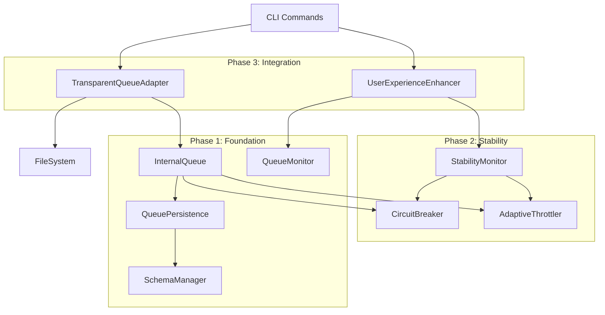

# CLI Integration Strategy

> 🔗 **Effect CLI와 Queue System의 완벽한 통합 전략**

## 📋 통합 철학

**핵심 원칙**: "투명성 | 호환성 | 점진성 | 확장성"

- **투명성**: 사용자는 큐 시스템의 존재를 인식하지 않음
- **호환성**: 기존 명령어와 100% 호환
- **점진성**: 단계적 도입으로 리스크 최소화  
- **확장성**: 미래 기능 확장을 위한 아키텍처

## 🏗️ 아키텍처 통합 전략

### Layer Composition Pattern

```typescript
// 통합 Layer 아키텍처
export const EffectCliLayer = Layer.mergeAll(
  // 🔧 Infrastructure Layer
  NodeContext.layer,
  
  // 📊 Queue Foundation (Phase 1)
  SchemaManagerLive,
  QueuePersistenceLive,
  InternalQueueLive,
  QueueMonitorLive,
  
  // 🛡️ Stability Layer (Phase 2)
  CircuitBreakerLive,
  AdaptiveThrottlerLive,
  StabilityMonitorLive,
  
  // 🔗 Integration Layer (Phase 3)
  TransparentQueueAdapterLive,
  UserExperienceEnhancerLive,
  
  // 🎯 Application Layer
  FileSystemLive.pipe(
    Layer.provide(TransparentQueueAdapterLive)
  )
)
```

### Service Dependency Graph



## 🔄 점진적 통합 전략

### Stage 1: Foundation Integration (Week 1)
**목표**: 기본 큐 시스템 구축 및 핵심 서비스 통합

```typescript
// Stage 1 Layer
const Stage1Layer = Layer.mergeAll(
  SchemaManagerLive,
  QueuePersistenceLive,
  InternalQueueLive,
  QueueMonitorLive
)

// 단일 명령어 테스트 통합
const testListCommand = listCommand.pipe(
  Effect.provide(Stage1Layer)
)
```

**검증 기준**:
- [ ] 스키마 초기화 정상 동작
- [ ] 기본 큐 enqueue/process 동작
- [ ] 단일 명령어 정상 실행

### Stage 2: Stability Integration (Week 2)
**목표**: 안정성 시스템 추가 및 장기 동작 검증

```typescript
// Stage 2 Layer
const Stage2Layer = Stage1Layer.pipe(
  Layer.merge(CircuitBreakerLive),
  Layer.merge(AdaptiveThrottlerLive),
  Layer.merge(StabilityMonitorLive)
)
```

**검증 기준**:
- [ ] Circuit Breaker 장애 복구 동작
- [ ] Adaptive Throttling 부하 대응
- [ ] 24시간 안정성 테스트 통과

### Stage 3: Transparent Integration (Week 3)
**목표**: 투명한 CLI 통합 및 사용자 경험 최적화

```typescript
// Stage 3 Layer (Production Ready)
const Stage3Layer = Stage2Layer.pipe(
  Layer.merge(TransparentQueueAdapterLive),
  Layer.merge(UserExperienceEnhancerLive)
)

// 모든 기존 명령어 투명 통합
const enhancedCommands = [
  listCommand,
  catCommand, 
  findCommand,
  sampleCommand,
  advancedCommand
].map(cmd => cmd.pipe(Effect.provide(Stage3Layer)))
```

**검증 기준**:
- [ ] 기존 명령어 100% 호환성
- [ ] 투명한 큐 적용 확인
- [ ] 사용자 경험 향상 검증

## 🔧 서비스 통합 패턴

### 1. Wrapper Pattern (기존 서비스 래핑)

```typescript
// FileSystem 서비스를 큐로 래핑
export const QueuedFileSystemLive = Layer.effect(
  FileSystem,
  Effect.gen(function* () {
    const originalFs = yield* FileSystem
    const queue = yield* InternalQueue
    
    const queuedOperations = {
      listDirectory: (path: string) =>
        Effect.gen(function* () {
          const task = createQueueTask("directory-list", "filesystem", () =>
            originalFs.listDirectory(path)
          )
          yield* queue.enqueue(task)
          return yield* task.operation
        }),
      
      readFile: (path: string) =>
        Effect.gen(function* () {
          const task = createQueueTask("file-read", "filesystem", () =>
            originalFs.readFile(path)
          )
          yield* queue.enqueue(task)
          return yield* task.operation
        })
      // ... 다른 메서드들
    }
    
    return FileSystem.of(queuedOperations)
  })
)
```

### 2. Adapter Pattern (투명한 통합)

```typescript
// 기존 명령어와 큐 시스템 연결
export const TransparentQueueAdapter = Context.GenericTag<{
  wrapService: <S>(service: S, resourceGroup: ResourceGroup) => S
  determineResourceGroup: (operation: string) => ResourceGroup
}>("@app/TransparentQueueAdapter")

// 사용 예제
const adapter = yield* TransparentQueueAdapter
const queuedFileSystem = adapter.wrapService(fileSystem, "filesystem")
```

### 3. Decorator Pattern (기능 확장)

```typescript
// 기존 명령어에 큐 기능 추가
export const withQueueSupport = <A extends Record<string, any>>(
  command: Command.Command<A>
): Command.Command<A & { queueStats?: boolean }> =>
  command.pipe(
    Command.withOptions({
      queueStats: Options.boolean("queue-stats").pipe(
        Options.withDescription("Show queue statistics after execution")
      )
    }),
    Command.map(({ queueStats, ...rest }) => 
      Effect.gen(function* () {
        const result = yield* rest
        
        if (queueStats) {
          const monitor = yield* QueueMonitor
          const status = yield* monitor.getQueueStatus()
          yield* Console.log(`\n📊 Queue: ${status.completedTasks} completed, ${status.pendingTasks} pending`)
        }
        
        return result
      })
    )
  )
```

## 🎯 명령어별 통합 전략

### 파일 시스템 명령어

| 명령어 | 리소스 그룹 | 통합 방법 | 예상 효과 |
|--------|-------------|-----------|-----------|
| `ls` | filesystem | TransparentAdapter | 디렉토리 스캔 최적화 |
| `cat` | filesystem | TransparentAdapter | 파일 읽기 큐잉 |
| `find` | computation | ResourceGroup 자동 분류 | CPU 집약적 검색 제어 |

### 새로운 큐 전용 명령어

```typescript
// Queue 관리 명령어 구조
const queueCommand = Command.make("queue", {}).pipe(
  Command.withSubcommands([
    Command.make("status"),     // 큐 상태 조회
    Command.make("clear"),      // 큐 정리
    Command.make("export"),     // 메트릭 내보내기
    Command.make("monitor"),    // 실시간 모니터링 (Phase 4)
    Command.make("config")      // 큐 설정 (Phase 4)
  ])
)
```

## 🔌 확장성 설계

### Plugin Architecture (Phase 4 준비)

```typescript
// 플러그인 시스템 인터페이스
export interface QueuePlugin {
  readonly name: string
  readonly version: string
  readonly resourceGroups?: ResourceGroup[]
  readonly customOperations?: Record<string, QueueOperation>
  readonly middleware?: QueueMiddleware[]
}

// 플러그인 로더
export const QueuePluginLoader = Context.GenericTag<{
  loadPlugin: (plugin: QueuePlugin) => Effect.Effect<void>
  unloadPlugin: (pluginName: string) => Effect.Effect<void>
  listPlugins: () => Effect.Effect<QueuePlugin[]>
}>("@app/QueuePluginLoader")
```

### Custom Resource Groups

```typescript
// 사용자 정의 리소스 그룹 등록
export const registerCustomResourceGroup = (
  name: string,
  config: ResourceGroupConfig
) => Effect.gen(function* () {
  const throttler = yield* AdaptiveThrottler
  yield* throttler.addResourceGroup(name, config)
})

// 예제: 데이터베이스 리소스 그룹
yield* registerCustomResourceGroup("database", {
  maxConcurrency: 3,
  priority: "high",
  adaptiveThresholds: {
    min: 1,
    max: 5,
    cpuThreshold: 0.7
  }
})
```

## 🚀 배포 전략

### Development Environment

```typescript
// 개발 환경용 설정
export const DevelopmentConfig = {
  queue: {
    enableLogging: true,
    enableMetrics: true,
    failFast: true,
    testMode: true
  },
  circuitBreaker: {
    failureThreshold: 3, // 낮은 임계값으로 빠른 테스트
    timeout: Duration.seconds(10)
  }
}
```

### Production Environment

```typescript
// 프로덕션 환경용 설정
export const ProductionConfig = {
  queue: {
    enableLogging: false,
    enableMetrics: true,
    failFast: false,
    optimizeForThroughput: true
  },
  circuitBreaker: {
    failureThreshold: 5, // 높은 임계값으로 안정성 확보
    timeout: Duration.seconds(30)
  },
  adaptiveThrottler: {
    aggressiveOptimization: true,
    loadBalancing: true
  }
}
```

### Rollback Strategy

```typescript
// 롤백 지원을 위한 Feature Flag
export const QueueFeatureFlags = {
  enableQueueSystem: true,
  enableTransparentIntegration: true,
  enableCircuitBreaker: true,
  enableAdaptiveThrottling: true,
  
  // 긴급 롤백 플래그
  fallbackToDirectExecution: false
}

// 조건부 Layer 적용
const conditionalLayer = QueueFeatureFlags.enableQueueSystem
  ? CompleteQueueSystemLayer
  : DirectExecutionLayer
```

## 🔍 모니터링 및 관찰성

### 메트릭 수집

```typescript
// 통합 메트릭 수집
export const IntegrationMetrics = {
  // 성능 메트릭
  commandExecutionTime: new Map<string, number[]>(),
  queueOverhead: new Map<string, number>(),
  
  // 안정성 메트릭
  circuitBreakerActivations: 0,
  throttlingAdjustments: 0,
  automaticRecoveries: 0,
  
  // 사용자 경험 메트릭
  transparencyViolations: 0,
  userConfusionIndicators: 0,
  helpRequestFrequency: 0
}
```

### 실시간 대시보드 (Phase 4)

```typescript
// 웹 기반 모니터링 인터페이스 준비
export const MonitoringDashboard = {
  endpoints: {
    "/queue/status": () => getQueueStatus(),
    "/queue/metrics": () => exportMetrics("json"),
    "/queue/health": () => performHealthCheck(),
    "/queue/history": () => getExecutionHistory()
  },
  
  websocketUpdates: {
    queueStatus: Duration.seconds(5),
    systemHealth: Duration.seconds(15),
    performanceMetrics: Duration.seconds(30)
  }
}
```

## ✅ 통합 완료 기준

### 기술적 기준
- [ ] **Layer 의존성**: 모든 서비스가 올바른 Layer 순서로 초기화
- [ ] **투명성**: 기존 명령어 API 변경 없음
- [ ] **성능**: CLI 시작 시간 2초 이내 유지
- [ ] **안정성**: 메모리 누수 없음, 자동 복구 동작

### 사용자 경험 기준
- [ ] **학습 비용**: 기존 사용자 추가 학습 불필요
- [ ] **직관성**: 새로운 큐 명령어도 직관적 사용 가능
- [ ] **피드백**: 적절한 진행률 표시 및 상태 알림
- [ ] **문제 해결**: 명확한 오류 메시지 및 해결 방법 제시

### 비즈니스 기준
- [ ] **호환성**: 기존 스크립트 및 워크플로우 100% 호환
- [ ] **확장성**: 새로운 명령어 쉽게 추가 가능
- [ ] **유지보수성**: 모듈화된 구조로 유지보수 용이
- [ ] **문서화**: 완전한 사용자 및 개발자 가이드

---

**📅 마지막 업데이트**: 2025-01-12  
**👤 담당자**: CLI Integration Architecture Team  
**📈 상태**: Ready for Implementation  
**🎯 우선순위**: Foundation → Stability → Integration