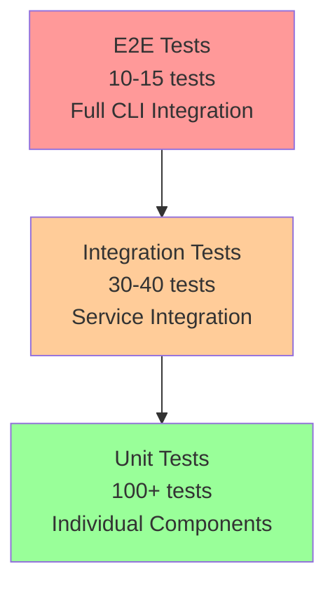

# Queue System Testing Strategy

> 🧪 **포괄적 테스트 전략 및 품질 보증 계획**

## 📋 테스트 철학

**핵심 원칙**: "신뢰성 | 커버리지 | 자동화 | 실제성"

- **신뢰성**: 모든 테스트는 일관된 결과를 보장
- **커버리지**: 단위 90%+, 통합 80%+, E2E 100% 핵심 시나리오  
- **자동화**: CI/CD 파이프라인 통합으로 회귀 방지
- **실제성**: 실제 사용 조건과 유사한 테스트 환경

## 🎯 테스트 피라미드



### Test Distribution Strategy

| Level | Coverage Target | Count | Focus | Tools |
|-------|----------------|--------|--------|-------|
| Unit | 90%+ | 100+ | 개별 컴포넌트 | Vitest, Effect Testing |
| Integration | 80%+ | 30-40 | 서비스 간 상호작용 | TestContext, Layer Testing |
| E2E | 100% 핵심 시나리오 | 10-15 | 완전한 CLI 워크플로우 | CLI Testing, Process Testing |

## 🧪 Phase별 테스트 전략

### Phase 1: Foundation Testing

#### 단위 테스트 (Unit Tests)

**파일**: `tests/unit/Queue/`

```typescript
// SchemaManager 단위 테스트
describe("SchemaManagerLive", () => {
  const TestLayer = Layer.mergeAll(
    TestContext.TestContext,
    SchemaManagerLive
  )
  
  it("should initialize database schema correctly", () =>
    Effect.gen(function* () {
      const manager = yield* SchemaManager
      
      // 스키마 초기화
      yield* manager.initializeDatabase()
      
      // 테이블 존재 확인
      const tablesExist = yield* manager.validateSchema()
      expect(tablesExist).toBe(true)
    }).pipe(
      Effect.provide(TestLayer),
      Effect.runPromise
    )
  )
  
  it("should handle schema migrations", () =>
    Effect.gen(function* () {
      const manager = yield* SchemaManager
      
      // 이전 버전 스키마로 시작
      yield* manager.migrateToVersion("1.0.0")
      
      // 최신 버전으로 마이그레이션
      yield* manager.migrateToVersion("2.0.0")
      
      // 마이그레이션 성공 확인
      const currentVersion = yield* manager.getCurrentVersion()
      expect(currentVersion).toBe("2.0.0")
    }).pipe(
      Effect.provide(TestLayer),
      Effect.runPromise
    )
  )
})

// QueuePersistence 단위 테스트
describe("QueuePersistenceLive", () => {
  const TestLayer = Layer.mergeAll(
    TestContext.TestContext,
    SchemaManagerLive,
    QueuePersistenceLive
  )
  
  it("should persist and load tasks correctly", () =>
    Effect.gen(function* () {
      const persistence = yield* QueuePersistence
      const sessionId = "test-session-123"
      
      // 테스트 작업 생성
      const task = createTestTask("test-operation", "filesystem")
      
      // 작업 저장
      yield* persistence.persistTask(task)
      
      // 작업 로드
      const loadedTasks = yield* persistence.loadPendingTasks(sessionId)
      
      expect(loadedTasks).toHaveLength(1)
      expect(loadedTasks[0].id).toBe(task.id)
      expect(loadedTasks[0].type).toBe("test-operation")
    }).pipe(
      Effect.provide(TestLayer),
      Effect.runPromise
    )
  )
  
  it("should handle session isolation", () =>
    Effect.gen(function* () {
      const persistence = yield* QueuePersistence
      
      // 두 개의 다른 세션에 작업 추가
      const task1 = createTestTask("task1", "filesystem")
      const task2 = createTestTask("task2", "network")
      
      yield* persistence.persistTask({ ...task1, sessionId: "session-1" })
      yield* persistence.persistTask({ ...task2, sessionId: "session-2" })
      
      // 세션별로 작업 조회
      const session1Tasks = yield* persistence.loadPendingTasks("session-1")
      const session2Tasks = yield* persistence.loadPendingTasks("session-2")
      
      expect(session1Tasks).toHaveLength(1)
      expect(session2Tasks).toHaveLength(1)
      expect(session1Tasks[0].id).toBe(task1.id)
      expect(session2Tasks[0].id).toBe(task2.id)
    }).pipe(
      Effect.provide(TestLayer),
      Effect.runPromise
    )
  )
})
```

**커버리지 목표**:
- [ ] SchemaManager: 95%+ (핵심 데이터 계층)
- [ ] QueuePersistence: 90%+ (지속성 보장)
- [ ] InternalQueue: 85%+ (큐 로직)
- [ ] QueueMonitor: 80%+ (모니터링 기능)

#### 통합 테스트 (Integration Tests)

**파일**: `tests/integration/Phase1/`

```typescript
// Phase 1 서비스 통합 테스트
describe("Phase 1 Service Integration", () => {
  const Phase1Layer = Layer.mergeAll(
    TestContext.TestContext,
    SchemaManagerLive,
    QueuePersistenceLive,
    InternalQueueLive,
    QueueMonitorLive
  )
  
  it("should integrate all Phase 1 services", () =>
    Effect.gen(function* () {
      // Given: 모든 Phase 1 서비스가 초기화됨
      const queue = yield* InternalQueue
      const monitor = yield* QueueMonitor
      const persistence = yield* QueuePersistence
      
      // When: 작업을 큐에 추가
      const task = createTestTask("integration-test", "filesystem")
      yield* queue.enqueue(task)
      
      // Then: 모든 서비스가 협력하여 작업 처리
      yield* Effect.sleep(Duration.millis(100)) // 처리 대기
      
      const status = yield* monitor.getQueueStatus()
      expect(status.totalTasks).toBe(1)
      expect(status.completedTasks).toBe(1)
      
      // 데이터베이스에 결과 저장 확인
      const completedTasks = yield* persistence.loadCompletedTasks(task.sessionId)
      expect(completedTasks).toHaveLength(1)
    }).pipe(
      Effect.provide(Phase1Layer),
      Effect.runPromise
    )
  )
})
```

### Phase 2: Stability Testing

#### 장기 안정성 테스트 (Long-term Stability)

**파일**: `tests/integration/Phase2/stability.test.ts`

```typescript
describe("Stability Systems", () => {
  const Phase2Layer = Layer.mergeAll(
    Phase1Layer,
    CircuitBreakerLive,
    AdaptiveThrottlerLive,
    StabilityMonitorLive
  )
  
  // 메모리 누수 테스트
  it("should not leak memory over extended operation", () =>
    Effect.gen(function* () {
      const initialMemory = process.memoryUsage()
      const queue = yield* InternalQueue
      
      // 1000개 작업 처리 시뮬레이션
      for (let i = 0; i < 1000; i++) {
        const task = createTestTask(`stress-${i}`, "filesystem")
        yield* queue.enqueue(task)
        
        if (i % 100 === 0) {
          // 100개마다 메모리 사용량 확인
          const currentMemory = process.memoryUsage()
          const heapGrowth = currentMemory.heapUsed - initialMemory.heapUsed
          
          // 메모리 증가량이 50MB 미만인지 확인
          expect(heapGrowth).toBeLessThan(50 * 1024 * 1024)
        }
      }
      
      // 모든 작업 완료 대기
      yield* waitForQueueCompletion()
      
      // 최종 메모리 정리 확인
      if (global.gc) global.gc()
      const finalMemory = process.memoryUsage()
      const totalGrowth = finalMemory.heapUsed - initialMemory.heapUsed
      
      expect(totalGrowth).toBeLessThan(10 * 1024 * 1024) // 10MB 미만
    }).pipe(
      Effect.provide(Phase2Layer),
      Effect.runPromise
    )
  )
  
  // Circuit Breaker 테스트
  it("should handle cascading failures gracefully", () =>
    Effect.gen(function* () {
      const breaker = yield* CircuitBreaker
      const monitor = yield* StabilityMonitor
      
      // 연속 실패 시뮬레이션
      for (let i = 0; i < 7; i++) {
        yield* breaker.execute(Effect.fail("service-failure")).pipe(Effect.flip)
      }
      
      // Circuit Breaker가 열렸는지 확인
      const state = yield* breaker.getState()
      expect(state).toBe("open")
      
      // 시스템이 여전히 건강한지 확인
      const health = yield* monitor.performHealthCheck()
      expect(health.isHealthy).toBe(true)
      
      // 자동 복구 대기
      yield* Effect.sleep(Duration.seconds(35))
      
      // 성공적인 작업으로 복구
      yield* breaker.execute(Effect.succeed("recovery-success"))
      yield* breaker.execute(Effect.succeed("recovery-success"))
      yield* breaker.execute(Effect.succeed("recovery-success"))
      
      const recoveredState = yield* breaker.getState()
      expect(recoveredState).toBe("closed")
    }).pipe(
      Effect.provide(Phase2Layer),
      Effect.runPromise
    )
  )
})
```

#### 부하 테스트 (Load Testing)

**파일**: `tests/performance/load.test.ts`

```typescript
describe("Load Testing", () => {
  const PerformanceTestLayer = Layer.mergeAll(
    Phase2Layer,
    PerformanceMonitoringLive
  )
  
  it("should handle high concurrency", () =>
    Effect.gen(function* () {
      const queue = yield* InternalQueue
      const throttler = yield* AdaptiveThrottler
      
      // 동시에 50개 작업 실행
      const tasks = Array.from({ length: 50 }, (_, i) => 
        createTestTask(`concurrent-${i}`, "filesystem")
      )
      
      const startTime = Date.now()
      
      // 모든 작업 동시 시작
      yield* Effect.forEach(
        tasks,
        task => queue.enqueue(task),
        { concurrency: "unbounded" }
      )
      
      // 완료 대기
      yield* waitForQueueCompletion()
      
      const endTime = Date.now()
      const totalTime = endTime - startTime
      
      // 처리 시간 검증 (30초 이내)
      expect(totalTime).toBeLessThan(30000)
      
      // 시스템 안정성 검증
      const systemLoad = yield* throttler.getSystemLoad()
      expect(systemLoad.cpu).toBeLessThan(0.9)
      expect(systemLoad.memory).toBeLessThan(0.9)
    }).pipe(
      Effect.provide(PerformanceTestLayer),
      Effect.runPromise
    )
  )
})
```

### Phase 3: Integration Testing

#### CLI 통합 테스트 (CLI Integration)

**파일**: `tests/integration/Phase3/cli-integration.test.ts`

```typescript
describe("CLI Queue Integration", () => {
  const CliIntegrationLayer = Layer.mergeAll(
    Phase2Layer,
    TransparentQueueAdapterLive,
    UserExperienceEnhancerLive
  )
  
  // 투명성 테스트
  it("should maintain CLI transparency", () =>
    Effect.gen(function* () {
      // CLI 명령어 직접 실행 시뮬레이션
      const result = yield* runCommand("ls", ["-la", "."])
      
      // 명령어 성공 확인
      expect(result.exitCode).toBe(0)
      expect(result.stdout).toContain("package.json")
      
      // 내부적으로 큐가 사용되었는지 확인
      const monitor = yield* QueueMonitor
      const status = yield* monitor.getQueueStatus()
      
      expect(status.totalTasks).toBeGreaterThan(0)
      expect(status.completedTasks).toBeGreaterThan(0)
    }).pipe(
      Effect.provide(CliIntegrationLayer),
      Effect.runPromise
    )
  )
  
  // 큐 명령어 테스트
  it("should provide queue management commands", () =>
    Effect.gen(function* () {
      // 큐 상태 명령어
      const statusResult = yield* runCommand("queue", ["status"])
      
      expect(statusResult.exitCode).toBe(0)
      expect(statusResult.stdout).toContain("Queue Status")
      expect(statusResult.stdout).toContain("Task Statistics")
      
      // 큐 내보내기 명령어
      const exportResult = yield* runCommand("queue", ["export", "json"])
      
      expect(exportResult.exitCode).toBe(0)
      const exportedData = JSON.parse(exportResult.stdout)
      expect(exportedData).toHaveProperty("sessionId")
      expect(exportedData).toHaveProperty("totalTasks")
    }).pipe(
      Effect.provide(CliIntegrationLayer),
      Effect.runPromise
    )
  )
})
```

## 🎭 End-to-End 테스트 시나리오

### 시나리오 1: 일반 사용자 워크플로우

```typescript
describe("End-to-End: Normal User Workflow", () => {
  const E2ELayer = ProductionCliLayer
  
  it("should complete typical file operations seamlessly", () =>
    Effect.gen(function* () {
      // 1. 프로젝트 디렉토리 탐색
      const lsResult = yield* runCliCommand(["ls", "-la"])
      expect(lsResult.exitCode).toBe(0)
      
      // 2. 패키지 정보 확인
      const catResult = yield* runCliCommand(["cat", "package.json"])
      expect(catResult.exitCode).toBe(0)
      expect(catResult.stdout).toContain("name")
      
      // 3. TypeScript 파일 검색
      const findResult = yield* runCliCommand(["find", "*.ts"])
      expect(findResult.exitCode).toBe(0)
      expect(findResult.stdout.split('\n').length).toBeGreaterThan(5)
      
      // 4. 큐 상태 확인 (선택적)
      const queueResult = yield* runCliCommand(["queue", "status"])
      expect(queueResult.exitCode).toBe(0)
      
      // 전체 워크플로우에서 시스템 건강성 확인
      const monitor = yield* StabilityMonitor
      const health = yield* monitor.performHealthCheck()
      expect(health.isHealthy).toBe(true)
    }).pipe(
      Effect.provide(E2ELayer),
      Effect.runPromise
    )
  )
})
```

### 시나리오 2: 시스템 관리자 워크플로우

```typescript
describe("End-to-End: System Admin Workflow", () => {
  it("should provide comprehensive system monitoring", () =>
    Effect.gen(function* () {
      // 1. 시스템 상태 전체 확인
      const statusResult = yield* runCliCommand(["queue", "status"])
      expect(statusResult.stdout).toContain("System Health")
      
      // 2. 메트릭 내보내기
      const exportResult = yield* runCliCommand([
        "queue", "export", "csv", "-o", "/tmp/queue-metrics.csv"
      ])
      expect(exportResult.exitCode).toBe(0)
      
      // 3. 파일 생성 확인
      const fileExists = yield* Effect.promise(() => 
        import("fs").then(fs => fs.promises.access("/tmp/queue-metrics.csv"))
      )
      expect(fileExists).not.toThrow()
      
      // 4. 큐 정리 (테스트 후 정리)
      const clearResult = yield* runCliCommand(["queue", "clear", "--force"])
      expect(clearResult.exitCode).toBe(0)
    }).pipe(
      Effect.provide(E2ELayer),
      Effect.runPromise
    )
  )
})
```

### 시나리오 3: 오류 복구 시나리오

```typescript
describe("End-to-End: Error Recovery", () => {
  it("should recover gracefully from various failures", () =>
    Effect.gen(function* () {
      // 1. 존재하지 않는 파일 읽기 시도
      const failResult = yield* runCliCommand(["cat", "nonexistent-file.txt"])
      expect(failResult.exitCode).not.toBe(0)
      
      // 2. 시스템이 여전히 건강한지 확인
      const healthResult = yield* runCliCommand(["queue", "status"])
      expect(healthResult.exitCode).toBe(0)
      expect(healthResult.stdout).toContain("Healthy")
      
      // 3. 정상 작업이 여전히 동작하는지 확인
      const normalResult = yield* runCliCommand(["ls"])
      expect(normalResult.exitCode).toBe(0)
      
      // 4. 오류 후 시스템 복구 확인
      const monitor = yield* StabilityMonitor
      const health = yield* monitor.performHealthCheck()
      expect(health.isHealthy).toBe(true)
    }).pipe(
      Effect.provide(E2ELayer),
      Effect.runPromise
    )
  )
})
```

## 🤖 테스트 자동화

### CI/CD 통합

**파일**: `.github/workflows/queue-testing.yml`

```yaml
name: Queue System Testing

on:
  push:
    branches: [main, develop]
  pull_request:
    branches: [main]

jobs:
  unit-tests:
    runs-on: ubuntu-latest
    steps:
      - uses: actions/checkout@v3
      - uses: oven-sh/setup-bun@v1
      
      - name: Install dependencies
        run: bun install
        
      - name: Run unit tests
        run: bun test tests/unit --coverage
        
      - name: Upload coverage
        uses: codecov/codecov-action@v3
        with:
          file: ./coverage/lcov.info

  integration-tests:
    runs-on: ubuntu-latest
    needs: unit-tests
    steps:
      - uses: actions/checkout@v3
      - uses: oven-sh/setup-bun@v1
      
      - name: Run integration tests
        run: bun test tests/integration
        
      - name: Run stability tests
        run: bun test tests/integration/stability --timeout 300000

  e2e-tests:
    runs-on: ubuntu-latest
    needs: integration-tests
    steps:
      - uses: actions/checkout@v3
      - uses: oven-sh/setup-bun@v1
      
      - name: Build CLI
        run: bun run build
        
      - name: Run E2E tests
        run: bun test tests/e2e
        
      - name: Performance regression test
        run: bun run test:performance

  load-tests:
    runs-on: ubuntu-latest
    if: github.ref == 'refs/heads/main'
    steps:
      - uses: actions/checkout@v3
      - uses: oven-sh/setup-bun@v1
      
      - name: Run load tests
        run: bun test tests/performance/load --timeout 600000
```

### 성능 회귀 테스트

**파일**: `tests/performance/regression.test.ts`

```typescript
describe("Performance Regression Tests", () => {
  const baselineMetrics = {
    cliStartupTime: 2000, // 2초
    queueOverhead: 10,    // 10ms
    memoryUsage: 100,     // 100MB
    throughput: 100       // 초당 100작업
  }
  
  it("should not regress CLI startup time", () =>
    Effect.gen(function* () {
      const startTime = Date.now()
      
      // CLI 시작 시뮬레이션
      yield* initializeCliWithQueue()
      
      const startupTime = Date.now() - startTime
      
      // 기준선 대비 20% 이내 허용
      expect(startupTime).toBeLessThan(baselineMetrics.cliStartupTime * 1.2)
    }).pipe(
      Effect.provide(ProductionCliLayer),
      Effect.runPromise
    )
  )
  
  it("should maintain throughput benchmarks", () =>
    Effect.gen(function* () {
      const queue = yield* InternalQueue
      
      const tasks = Array.from({ length: 1000 }, (_, i) => 
        createTestTask(`perf-${i}`, "filesystem")
      )
      
      const startTime = Date.now()
      
      yield* Effect.forEach(tasks, task => queue.enqueue(task))
      yield* waitForQueueCompletion()
      
      const totalTime = Date.now() - startTime
      const throughput = 1000 / (totalTime / 1000) // 초당 작업 수
      
      // 기준선 처리량 90% 이상 유지
      expect(throughput).toBeGreaterThan(baselineMetrics.throughput * 0.9)
    }).pipe(
      Effect.provide(ProductionCliLayer),
      Effect.runPromise
    )
  )
})
```

## 🎯 테스트 환경 구성

### 테스트 전용 Layer

```typescript
// 테스트 환경 전용 설정
export const TestingEnvironmentLayer = Layer.mergeAll(
  TestContext.TestContext,
  
  // 메모리 데이터베이스 사용
  Layer.succeed(SchemaManager, {
    initializeDatabase: () => Effect.succeed(":memory:"),
    validateSchema: () => Effect.succeed(true),
    cleanup: () => Effect.unit
  }),
  
  // 빠른 Circuit Breaker (테스트용)
  Layer.succeed(CircuitBreaker, {
    failureThreshold: 2,
    timeout: Duration.seconds(1),
    successThreshold: 1
  }),
  
  // 테스트 친화적 설정
  TestConfigurationLive
)

// Mock 서비스들
export const MockFileSystemLive = Layer.succeed(FileSystem, {
  listDirectory: () => Effect.succeed([
    { name: "test.txt", isDirectory: false, size: 100n }
  ]),
  readFile: () => Effect.succeed("test content"),
  writeFile: () => Effect.unit
})
```

### 테스트 유틸리티

```typescript
// 테스트 헬퍼 함수들
export const TestUtils = {
  createTestTask: (type: OperationType, resourceGroup: ResourceGroup) => ({
    id: crypto.randomUUID(),
    sessionId: "test-session",
    type,
    resourceGroup,
    operation: Effect.succeed(`${type} completed`),
    priority: 1,
    estimatedDuration: Duration.seconds(1),
    status: "pending" as TaskStatus
  }),
  
  waitForQueueCompletion: (timeoutMs = 30000) =>
    Effect.gen(function* () {
      const monitor = yield* QueueMonitor
      
      yield* Effect.repeat(
        Effect.gen(function* () {
          const status = yield* monitor.getQueueStatus()
          if (status.runningTasks === 0 && status.pendingTasks === 0) {
            return true
          }
          yield* Effect.sleep(Duration.millis(100))
          return false
        }),
        Schedule.recurWhile(result => !result),
        Schedule.upTo(Duration.millis(timeoutMs))
      )
    }),
  
  runCliCommand: (args: string[]) =>
    Effect.gen(function* () {
      // CLI 명령어 실행 시뮬레이션
      const result = yield* Command.run(command, {
        name: "test-cli",
        version: "test"
      })(args)
      
      return result
    })
}
```

## ✅ 테스트 완료 기준

### 커버리지 목표
- [ ] **단위 테스트**: 90%+ 라인 커버리지
- [ ] **통합 테스트**: 80%+ 서비스 간 상호작용
- [ ] **E2E 테스트**: 100% 핵심 사용자 시나리오

### 성능 기준
- [ ] **CLI 시작**: 2초 이내
- [ ] **큐 오버헤드**: 10ms 이내  
- [ ] **메모리 사용**: 100MB 이내 유지
- [ ] **처리량**: 초당 100+ 작업

### 안정성 기준
- [ ] **장기 운영**: 24시간 연속 동작
- [ ] **메모리 누수**: 1시간당 10MB 이내 증가
- [ ] **자동 복구**: 5초 이내 장애 복구
- [ ] **동시성**: 50개 동시 작업 안전 처리

### 사용자 경험 기준
- [ ] **투명성**: 기존 워크플로우 100% 호환
- [ ] **직관성**: 새로운 큐 명령어 학습 비용 최소화
- [ ] **신뢰성**: 모든 핵심 시나리오 안정적 동작

---

**📅 마지막 업데이트**: 2025-01-12  
**👤 담당자**: Queue System QA Team  
**📈 상태**: Ready for Implementation  
**🎯 우선순위**: Unit → Integration → E2E → Performance